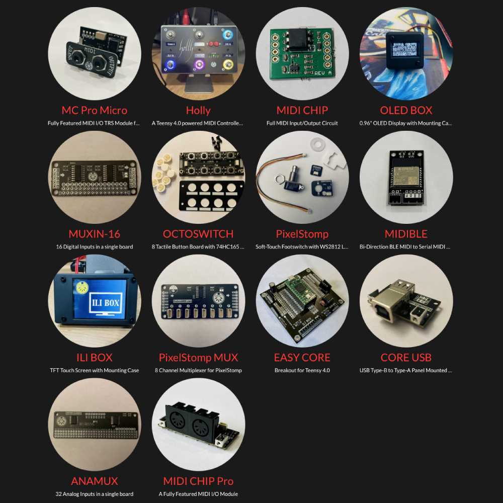

*Under MIT license.*

[RoxXxtar.com/bmc](https://www.roxxxtar.com/bmc)

# RoxMux

RoxMux is a Collection of Multiplexer Utilities for some commonly used multiplexer chips along with other hardware like buttons & leds. RoxMux was designed to with Arduino MIDI Controllers in mind to aid in adding lots of buttons/leds/pots/etc, however, you may use any of the available Utilities for any other project where RoxMux will come in handy.

RoxMux is compatible with Teensy and most Arduino boards. You can instal RoxMux from the Arduino Library Manager!

**See examples for code information.**

RoxMux contains multiple libraries in one, just include `<RoxMux.h>` to get started. All the libraries are templated to reduce RAM usage.

No matter which mux or utility you will be using, you always have to include `#include <RoxMux.h>` this file will include all the RoxMux controllers.

## Support RoxMux Development
To support RoxMux Development you can can buy products from the BadassMIDI Shop @ [BadassMIDI.com](http://www.badassmidi.com)

RoxMux includes support for:

- [74HC165](docs/74HC165.md) *(8-bit digital input shift register)*
- [74HC595](docs/74HC595.md) *(8-bit digital output shift register)*
- [74HC4067](docs/74HC4067.md) *(16-channel analog multiplexer)*
- [74HC4051](docs/74HC4067.md) *(8-channel analog multiplexer)*
- [MCP23017 & MCP23018](docs/MCP23017.md) *(16-channel I2C GPIO, in RoxMux v1.1.4)*
- [RoxTCA9548A](docs/RoxTCA9548A.md) *(8-channel I2C Multiplexer, in RoxMux v1.2.1)*

In Addition as of Version 1.1.3 RoxMux introduces utilities to debounce buttons, encoders and pots and control other hardware like LEDs and Relays.

- [RoxButton](docs/RoxButton.md) *(in RoxMux v1.1.3)*
- [RoxEncoder](docs/RoxEncoder.md) *(in RoxMux v1.1.4)*
- [RoxPot](docs/RoxPot.md) *(in RoxMux v1.1.4)*
- [RoxLed](docs/RoxLed.md) *(utility to control/blink/pulse leds, in RoxMux v1.3.0)*
- [RoxLatchingRelay](docs/RoxLatchingRelay.md) *(utility to control latching relays, in RoxMux v1.4.0)*
- [RoxNonLatchingRelay](docs/RoxNonLatchingRelay.md) *(utility to control non-latching relays, in RoxMux v1.4.0)*

Version 1.1.5 adds RoxLedMeter, a tool to create a VU Meter with Leds.

- [RoxLedMeter](docs/RoxLedMeter.md) *(a tool to create a VU Meter with Leds, in RoxMux v1.1.6)*

Version 1.1.9 adds `.latched()` and `.unlatched()` to RoxButton for latching switches, see the examples.

Version 1.4.1 removes use of analogWrite when compiling for ESP32.

Version 1.4.2 adds `RoxLogLifo` a *Last In, First Out* circular buffer for logging messages.

- [RoxLogLifo](docs/RoxLogLifo.md) *(in RoxMux v1.4.1)*

Version 1.4.5 adds `.pulse()` method to `RoxLed`, it can be used instead of .on() if you only want to momentarily then turn off without continously pulsing it.

Version 1.4.6 adds `RoxMidiClock` and `RoxMidiActiveSensing` for MIDI use, these both can be used with any MIDI Port like Serial/USB/USB HOST, they are simple tools that doesn't use interrupts so I recommend using this with fast boards like Teensy 3/4.

- [RoxMidiClock](docs/RoxMidiClock.md) *(in RoxMux v1.4.6)*
- [RoxMidiActiveSense](docs/RoxMidiClock.md) *(in RoxMux v1.4.6)*
