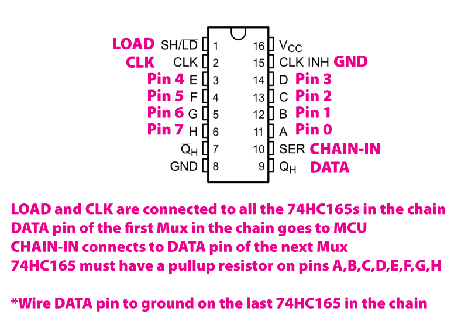

*Under MIT license.*

[RoxXxtar.com/bmc](https://www.roxxxtar.com/bmc)

[<< Repository](../README.md)

# Rox74HC165

This is a simple library to read one or more daisy-chained 74HC165 multiplexers, it's intended for use with Teensy boards.

See the examples for code information.

**NOTE:** wire pin 10 of the last 74HC165 to ground.

