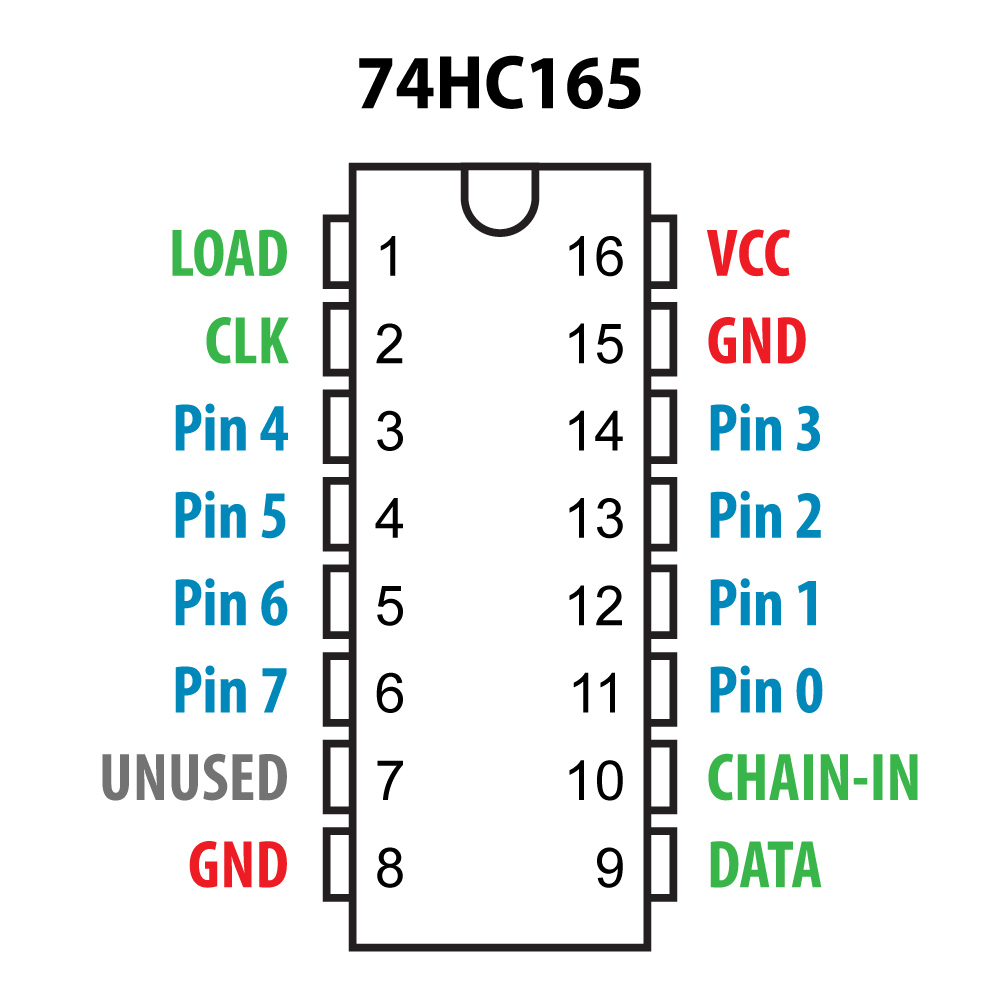

*Under MIT license.*

[RoxXxtar.com/bmc](https://www.roxxxtar.com/bmc)

[<< Repository](../README.md)

# Rox74HC165

This is a simple library to read one or more daisy-chained 74HC165 multiplexers, it was designed for use with Teensy boards but any other arduino compatible boards should also work.

Notes:
- LOAD and CLK are connected to all the 74HC165's in the chain.
- DATA pin of the first Mux in the chain foes to MCU.
- CHAIN-IN connects to DATA pin of the next Mux.
- 74HC165 must have a pullup resistor of pins 0 to 7

See the examples for code information.

**NOTE:** wire pin 10 of the last 74HC165 in a chain to ground (also if you're only using 1).

