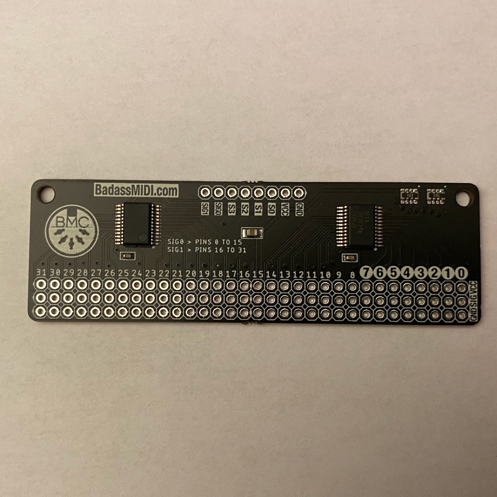

*Under MIT license.*

[RoxXxtar.com/bmc](https://www.roxxxtar.com/bmc)

[<< Repository](../README.md)

# Rox74HC4067 / Rox74HC4051

This is a simple library to read one or more daisy-chained 74HC4067/74HC4051 multiplexers,
it's intended for use with Teensy boards.

See the examples for code information.

## Meet ANAMUX
ANAMUX is a dual 74HC4067 board with 32 inputs! get yours at [https://www.roxxxtar.com/badassmidi-anamux](https://www.roxxxtar.com/badassmidi-anamux)

Your purchase helps development of BMC and RoxMux.

