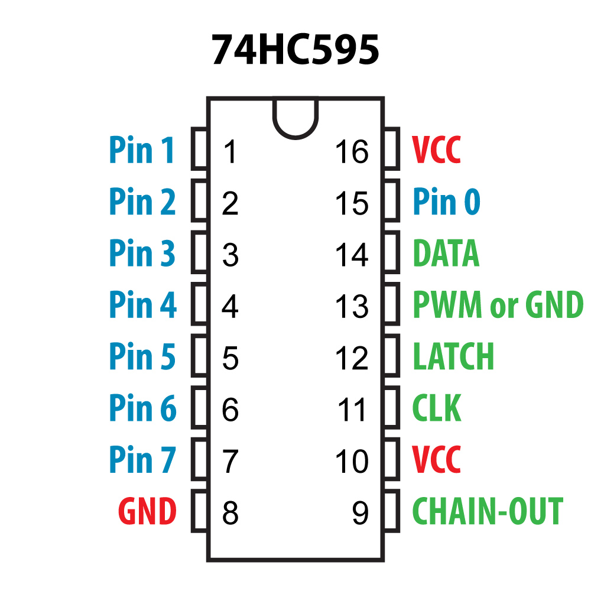

*Under MIT license.*

[RoxXxtar.com/bmc](https://www.roxxxtar.com/bmc)

[<< Repository](../README.md)

# Rox74HC595

This is a simple library to control one or more daisy-chained 74HC595 multiplexers, it's intended for use with Teensy boards.

Notes:
- LOAD and CLK are connected to all the 74HC165's in the chain.
- DATA pin of the first Mux in the chain foes to MCU.
- CHAIN-OUT connects to DATA pin of the next Mux.
- Pins 0 to 7 will need a resistor inline to limit current to each led.

See the examples for code information.

**NOTE:** wire pin 11 of 74HC595 to VCC.

