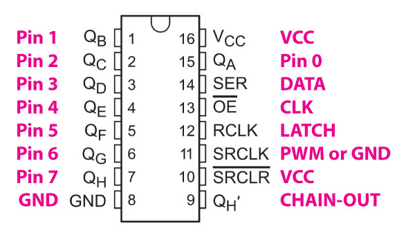

*Under MIT license.*

[RoxXxtar.com/bmc](https://www.roxxxtar.com/bmc)

[<< Repository](../README.md)

# Rox74HC595

This is a simple library to control one or more daisy-chained 74HC595 multiplexers, it's intended for use with Teensy boards.

See the examples for code information.

**NOTE:** wire pin 11 of 74HC595 to VCC.

