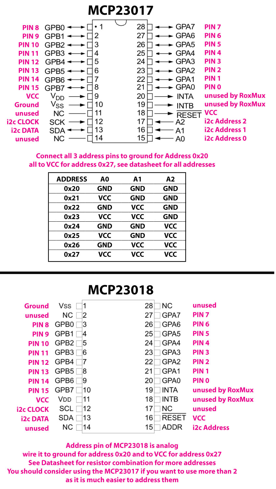

*Under MIT license.*

[RoxXxtar.com/bmc](https://www.roxxxtar.com/bmc)

[<< Repository](../README.md)

# RoxMCP23017 and RoxMCP23018

This is a simple library to read and write to the MCP23017 and/or MCP23018

You can control them the same way you would a built-in pin using pinMode(), digitalRead() and digitalWrite()

See the examples for code information.

GPIO on MCP23017 goes like this:
- GPA0 = pin 0
- GPA1 = pin 1
- GPA2 = pin 2
- GPA3 = pin 3
- GPA4 = pin 4
- GPA5 = pin 5
- GPA6 = pin 6
- GPA7 = pin 7
- GPB0 = pin 8
- GPB1 = pin 9
- GPB2 = pin 10
- GPB3 = pin 11
- GPB4 = pin 12
- GPB5 = pin 13
- GPB6 = pin 14
- GPB7 = pin 15

### Wiring


```c++
#include <RoxMux.h>

// 0x20 is the address of the MCP2301X chip
// if you plan on using multiple MCPs just create an instance for each one
// and pass the address
// change to RoxMCP23018 if you want for the MCP23018 tho both work with the same code
RoxMCP23017 <0x20> mux;

void setup(){
  // begin the mux, the parameter passed determines the i2c speed, normal or fast
  // true is fast @ 400kbit/s, false is standard @ 100kbit/s
  mux.begin(true);
  // ALWAYS CALL .pinMode() in your setup as it's only implemented once.
  // a pin can not change it's mode on the fly only before the first time
  // .update() is called

  // set the first 8 pins as output and connect leds with resistors
  mux.pinMode(0, OUTPUT); // pin 0 = GPA0 of MCP2301X
  mux.pinMode(1, OUTPUT); // pin 1 = GPA1 of MCP2301X
  mux.pinMode(2, OUTPUT); // pin 2 = GPA2 of MCP2301X
  mux.pinMode(3, OUTPUT); // pin 3 = GPA3 of MCP2301X
  mux.pinMode(4, OUTPUT); // pin 4 = GPA4 of MCP2301X
  mux.pinMode(5, OUTPUT); // pin 5 = GPA5 of MCP2301X
  mux.pinMode(6, OUTPUT); // pin 6 = GPA6 of MCP2301X
  mux.pinMode(7, OUTPUT); // pin 7 = GPA7 of MCP2301X

  // set the last 8 pins as inputs with the built in pullup resistor
  // wire a momentary button for each of these pins on one end the other to ground
  mux.pinMode(8,  INPUT_PULLUP); // pin 8  = GPB0 of MCP2301X
  mux.pinMode(9,  INPUT_PULLUP); // pin 9  = GPB1 of MCP2301X
  mux.pinMode(10, INPUT_PULLUP); // pin 10 = GPB2 of MCP2301X
  mux.pinMode(11, INPUT_PULLUP); // pin 11 = GPB3 of MCP2301X
  mux.pinMode(12, INPUT_PULLUP); // pin 12 = GPB4 of MCP2301X
  mux.pinMode(13, INPUT_PULLUP); // pin 13 = GPB5 of MCP2301X
  mux.pinMode(14, INPUT_PULLUP); // pin 14 = GPB6 of MCP2301X
  mux.pinMode(15, INPUT_PULLUP); // pin 15 = GPB7 of MCP2301X
}
void loop(){
  // update the mux readings
  // the parameter passed is for a delay or wait in milliseconds, default: 1ms
  // this delay does NOT use the arduino delay() function, instead it uses
  // millis() so it is non-blocking, this delay is used to avoid reading the MCP
  // too often which would slow down your program.
  // you may set this value to 0 if you don't want any delay between readings.
  // all 16 pins are read at the same time, the state of inputs and outputs is
  // held in ram by the library so you can check what the last state of a pin was.
  mux.update(1);
  for(uint8_t i=0;i<8;i++){
    // turn each led on when you press the corresponding button, in otherwords
    // if you press the button connected to pin 8, the led in pin 0 will turn on
    // if you press the button connected to pin 9, the led in pin 1 will turn on
    // if you press the button connected to pin 10, the led in pin 2 will turn on
    // and so on
    mux.digitalWrite(i, !mux.digitalRead(i+8));
  }
}
```
